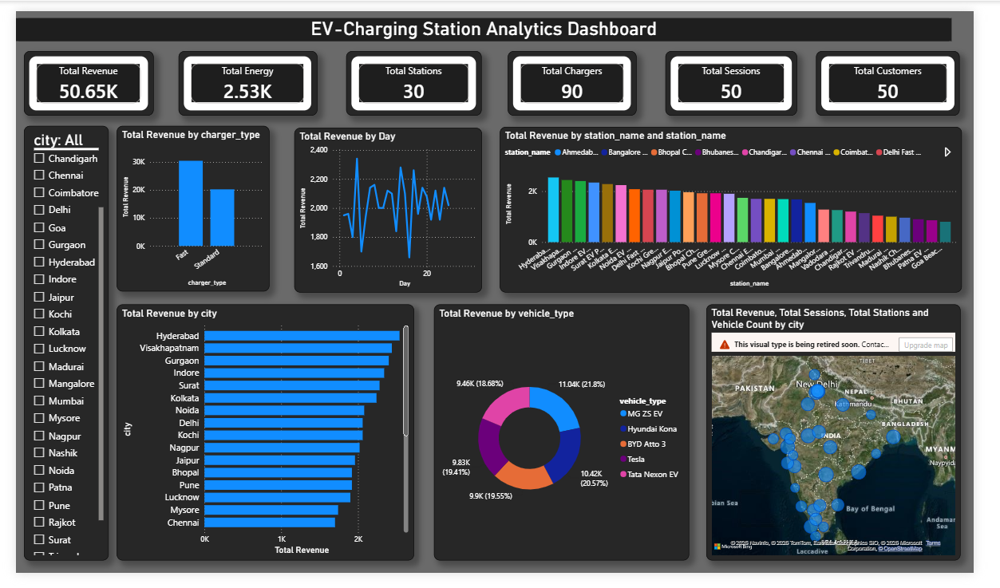
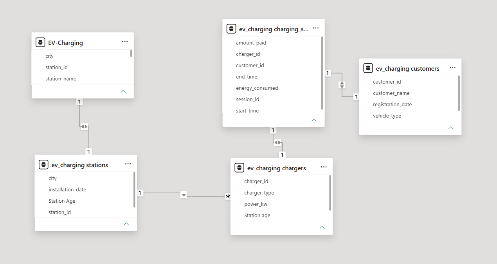

# ⚡ EV Charging Station Analytics Dashboard | Power BI

## 📌 Project Overview

The **EV Charging Station Analytics Dashboard** is an interactive Power BI solution developed to analyze the operational performance of electric vehicle charging stations. The dashboard consolidates charging session, customer, station, charger, and revenue data into a single reporting interface, enabling users to monitor key business metrics and identify operational trends.

This project demonstrates the implementation of data modeling, Power Query transformations, DAX calculations, and interactive dashboard development using Power BI.

---

# 🎯 Business Problem

Electric vehicle charging networks generate large volumes of operational data from multiple charging stations. Without a centralized analytical solution, it becomes difficult to:

- Monitor charging station performance
- Analyze revenue generation
- Track customer activity
- Measure energy consumption
- Compare charger utilization across cities
- Identify business growth opportunities

The objective of this project is to convert raw operational data into meaningful business insights through an interactive Power BI dashboard.

---

# 🎯 Project Objectives

- Analyze charging station performance.
- Monitor revenue generated from charging sessions.
- Track customer usage across cities.
- Analyze charger utilization.
- Monitor energy consumption.
- Compare station performance.
- Provide interactive filtering for business users.
- Support data-driven business decisions.

---

# 🛠️ Tools & Technologies Used

| Tool | Purpose |
|------|----------|
| Power BI Desktop | Dashboard Development |
| Power Query | Data Cleaning & Transformation |
| DAX | Calculated Columns & Measures |
| Excel | Dataset Source |
| GitHub | Project Documentation |

---

# 📊 Dashboard Features

The dashboard includes the following components:

### KPI Cards

- Total Revenue
- Total Energy Consumed
- Total Charging Stations
- Total Chargers
- Total Charging Sessions
- Total Customers

### Interactive Slicer

- City Filter

### Visualizations

- Revenue by Charger Type
- Revenue Trend by Day
- Revenue by Charging Station
- Revenue by City
- Revenue by Vehicle Type
- Geographic Map Analysis

---

# 📂 Dataset Information

The project is built using multiple related datasets.

### Tables Used

- Charging Stations
- Charging Sessions
- Customers
- Chargers
- Calendar

The datasets are connected using one-to-many relationships to enable efficient analysis.

---

# 🧹 Data Preparation

Data preprocessing was completed using Power Query.

The following transformations were performed:

- Removed duplicate records
- Changed data types
- Renamed columns
- Removed unnecessary columns
- Created calculated columns
- Validated missing values
- Established relationships between tables

---

# 📈 Data Model

The project uses a relational data model with multiple related tables connected through one-to-many relationships.

The relationships enable seamless filtering across charging stations, charging sessions, customers, and calendar data.

---

# 📊 Key Performance Indicators

The dashboard monitors the following KPIs:

- Total Revenue
- Total Energy
- Total Customers
- Total Charging Sessions
- Total Charging Stations
- Total Chargers

---

# 📊 Business Insights

The dashboard enables business users to identify:

- Highest revenue generating charging stations
- Revenue distribution across cities
- Most utilized charger types
- Vehicle-wise charging trends
- Daily revenue trends
- Customer usage patterns
- Station performance comparison

---

# 💡 Skills Demonstrated

This project demonstrates practical knowledge of:

- Power BI
- Data Visualization
- Data Modeling
- Power Query
- DAX
- Dashboard Design
- Data Cleaning
- Business Intelligence
- Analytical Thinking

---

# 📷 Dashboard Preview

---

# 📷 Data Model

---

# 📁 Project Structure

EV-Charging-Station-Analytics

├── Dashboard.pbix

├── README.md

├── Dataset

├── Images

├── Dataset_Description.md

├── DAX_Measures.md

├── Business_Insights.md

├── Technical_Documentation.md

└── Project_Report.pdf

---

# 🚀 Future Enhancements

- Drill-through reports
- Dynamic tooltips
- Bookmark navigation
- Row-Level Security (RLS)
- Power BI Service deployment
- Scheduled data refresh
- Performance optimization

---

# 📌 Conclusion

The EV Charging Station Analytics Dashboard transforms operational charging data into actionable business insights through interactive reporting and visualization.

The dashboard enables stakeholders to monitor revenue, customer activity, station utilization, and charging trends, supporting informed decision-making and improving operational efficiency.

---

## ⭐ If you found this project useful, consider giving it a star on GitHub!